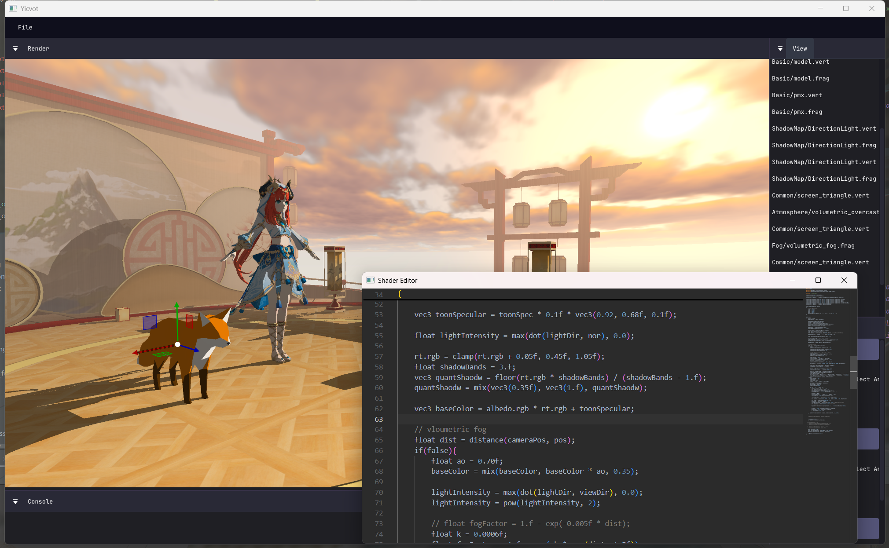
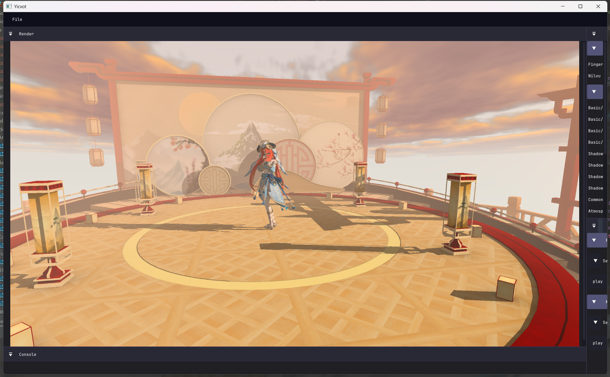

# vkCelShadingRenderEngine

> Polished English version by ChatGPT. \
> ⚠️ Note: During translation and polishing, GPT may have described the features as more complete or functional than they currently are — apologies in advance. : (

[简体中文](README.zh-CN.md)

## Overview

- This repository is a personal record of self-learning and engineering practice, mainly for learning and personal use.
  Any suggestions or feedback are welcome!
- Mainly used for exploring and learning Vulkan by myself. All comments and advice are appreciated. (╹▽╹)

### Screenshots

 

### Learning Goals & Planned Features

> *Note: The following features are goals or planned work. Most are still in progress and not yet available in the
current codebase.*

**vkCelShadingRenderEngine = Architecture * Atmosphere * Elegance + Bonus**

---

- **System Graph**

  Unified management and scheduling of global systems, including subsystems such as the render graph.
- **Advanced Vulkan Extensions**

  GPU-side parallel command buffer construction.
- **High-End Rendering Effects**

  Voxel grid volumetric fog/clouds and physically-based precomputed atmosphere.
- **Animation System**

  Deconstructing Saba library for future experiments in VR, physics, and cloth simulation.
- **Optimization && AI**

### Current Project Status

> Each item is marked with one of the following statuses:
>
> - ✔️  A basic implementation exists and is functional (may not be fully complete).
> - 📋  Work in progress: partially implemented or planned but not fully realized.
> - ❌  Deprecated or abandoned: feature has been removed or is no longer supported.
>
> This section reflects the **actual progress and core features** of the engine,
> rather than long-term aspirations or experimental prototypes.

| Engine Architecture | Status | Notes     / Progress                                                  | Refactor / Plan                            |
|---------------------|:------:|-----------------------------------------------------------------------|--------------------------------------------|
| Event               |   ✔️   | Global pub/sub, async, unique events                                  | Sub-event mounting on main event, sync     |
| Task                |   📋   |                                                                       | Global task execution via tbb_graph        |
| Storage             |   ✔️   | Thread-safe storage, type-safe opt                                    | Refactor into central storage, remove HANA |
| ECS                 |   ✔️   | EnTT-based, modular                                                   |                                            |
| Threads             |   ✔️   | Window / fast logic / slow logic / render threads, triple-buffer sync | Further split render thread, decouple cmd  |
| Animation           |   ✔️   | Assimp+Saba, skin+VMD, parallel multi-model playback                  | Deconstruct Saba, move data into ECS       |
| Audio/video         |   ✔️   | miniaudio, music playback & pause                                     | Support for exporting mp4, ffmpeg          |
| Material            |   📋   |                                                                       | In the new folder  :)                      |
| Physical            |   📋   | Too far away                                                          | plan to learn jolt                         |
| Scene               |   ✔️   | Scene management, global TLAS                                         | Dynamic TLAS / Static TLAS                 |
| Light               |   📋   |                                                                       | Add point light support                    |

| Rendering System   | Status | Notes / Progress                                                            | Refactor / Plan                     |
|--------------------|:------:|-----------------------------------------------------------------------------|-------------------------------------|
| Dynamic Rendering  |   ✔️   | VK_KHR_dynamic_rendering, no framebuffer                                    |                                     |
| Render Graph       |   ✔️   | Basic graph, auto dependency resolution                                     | Async scheduling, GPU timing        |
| Deferred Rendering |   ✔️   | G-buffer pipeline                                                           | /                                   |
| Sync (Semaphore)   |   ✔️   | Timeline semaphore, VK_KHR_synchronization2                                 |                                     |
| Descriptor System  |   ✔️   | Global set0, bindless ready                                                 | Migrate to VK_EXT_descriptor_buffer |
| Pipeline Library   |   ✔️   | Precompiled pipelines, dynamic switching                                    | /                                   |
| Allocator          |   ✔️   | VMA-based, LRU allocator                                                    | Three-pool, lighter interface       |
| Command System     |   ✔️   | Thread-local cmd pools, efficient recycling                                 | Parallel build path                 |
| FIFO-latest        |   ❌    | Swapchain bug occurs at high frame rates                                    |                                     |
| RT Shadows         |   ✔️   | VK_KHR_ray_tracing, dynamic BLAS                                            | Multiple light source support       |
| Shadow Map         |   ❌    | halfway done, but not need it for the time being.                           | if need later                       |
| Volumetric Clouds  |   ✔️   | Ray-marching, Shadertoy migrated                                            | Learn precomputed atmosphere        |
| Volumetric Fog     |   ✔️   | Ray-marching, screen-space fog                                              | Semi-voxel grid volumetric fog      |
| HDR                |   ❌    | Swapchain & post-process images replaced with HDR layout, no visible effect | shelve                              |
| Mesh Shader        |   📋   | VK_EXT_mesh_shader planned                                                  | replace vertex shader               |

| Resource Systems       | Status | Notes / Progress                          | Refactor / Plan                                     |
|------------------------|:------:|-------------------------------------------|-----------------------------------------------------|
| Async Resource Loading |   ✔️   | Async loading, avoid main thread, barrier | Parallelization, Unified construction tlas          |
| Standard Model         |   ✔️   | Assimp loading, std::pmr::vector          | Combine pmr with mimalloc                           |
| Standard Images        |   ✔️   | stb_image loading                         | Split Image class, move part to RT                  |
| MMD Support            |   ✔️   | Saba-based implementation                 | Same refactor plan as Assimp Model                  |
| Chinese Path           |   ✔️   | Boost_locale for Windows path issues      | Remove locale (over-engineered solution)            |
| Resource pool          |   📋   | std::pmr::unsynchronized_pool_resource    | Multi-pool to avoid fragmentation，std::pmr+mimalloc |

| Toolchain / Editor Systems  | Status | Notes / Progress                                              | Refactor / Plan          |
|-----------------------------|:------:|---------------------------------------------------------------|--------------------------|
| Shader Hot Reload           |   ✔️   | Monaco-editor + webview, Ctrl+S hot compile                   | VK_EXT_shader_object     |
| Window Drag & Docking       |   ✔️   | ImGui docking                                                 |                          |
| Model Basic Manipulation    |   ✔️   | ImGuizmo support                                              |                          |
| Model Selection (ID buffer) |   ✔️   | Render ID buffer, mouse mapping via ImGui, EnTT entity ID map | multiple-choice          |
| Debug Output                |   📋   | Planned Vulkan debug output / GPU markers                     |                          |
| Folder                      |   📋   |                                                               | Display engine resources |

| Vulkan Extension / Feature            | Status | Refactor / Plan |
|---------------------------------------|:------:|-----------------|
| VK_LAYER_KHRONOS_validation           |   ✔️   |                 |
| VK_EXT_debug_utils                    |   ✔️   |                 |
| ShaderInt64 (feature)                 |   📋   |                 |
| SamplerAnisotropy (feature)           |   📋   |                 |
| GeometryShader (feature)              |   📋   |                 |
| RobustBufferAccess (feature)          |   📋   |                 |
| TessellationShader (feature)          |   📋   |                 |
| VK_KHR_swapchain                      |   ✔️   |                 |
| VK_KHR_deferred_host_operations       |   📋   |                 |
| VK_KHR_spirv_1_4                      |   📋   |                 |
| VK_KHR_create_renderpass2             |   ❌    |                 |
| VK_KHR_pipeline_library               |   ✔️   |                 |
| VK_KHR_shader_non_semantic_info       |   📋   |                 |
| VK_EXT_pipeline_creation_feedback     |   ✔️   |                 |
| VK_KHR_ray_tracing_pipeline           |   ✔️   |                 |
| VK_KHR_acceleration_structure         |   ✔️   |                 |
| VK_KHR_buffer_device_address          |   ✔️   |                 |
| VK_KHR_synchronization2               |   ✔️   |                 |
| VK_KHR_timeline_semaphore             |   ✔️   |                 |
| VK_KHR_dynamic_rendering              |   ✔️   |                 |
| VK_KHR_pipeline_executable_properties |   📋   |                 |
| VK_EXT_shader_object                  |   📋   |                 |
| VK_EXT_descriptor_indexing            |   ✔️   |                 |
| VK_EXT_descriptor_buffer              |   📋   |                 |
| VK_EXT_transform_feedback             |   📋   |                 |
| VK_EXT_conditional_rendering          |   📋   |                 |
| VK_EXT_graphics_pipeline_library      |   ✔️   |                 |
| VK_EXT_shader_module_identifier       |   📋   |                 |
| VK_NVX_multiview_per_view_attributes  |   📋   |                 |
| VK_NV_device_generated_commands       |   📋   |                 |
| VK_EXT_mesh_shader                    |   📋   |                 |
| VK_KHR_dynamic_rendering_local_read   |   ✔️   |                 |
| VK_EXT_robustness2                    |   📋   |                 |

| Third-party Libraries  | ✔️ | 🚧 | 📋 | ❌ | Refactor / Plan  |
|------------------------|:--:|:--:|:--:|:-:|------------------|
| assimp                 | ✔️ |    |    |   |                  |
| boost                  | ✔️ |    |    |   | Planned removal  |
| entt                   | ✔️ |    |    |   |                  |
| flecs                  |    |    |    | ❌ |                  |
| glfw                   | ✔️ |    |    |   |                  |
| glm                    | ✔️ |    |    |   |                  |
| mimalloc               | ✔️ |    |    |   |                  |
| miniaudio              | ✔️ |    |    |   |                  |
| nlohmann               | ✔️ |    |    |   |                  |
| oneapi                 | ✔️ |    |    |   |                  |
| ozz                    |    |    | 📋 |   |                  |
| spdlog                 | ✔️ |    |    |   |                  |
| stb                    | ✔️ |    |    |   |                  |
| webview                | ✔️ |    |    |   |                  |
| saba                   | ✔️ |    |    |   | Being refactored |
| imgui-docking/imguizmo | ✔️ |    |    |   |                  |
| cuda                   |    |    | 📋 |   |                  |
| bullet                 |    |    |    | ❌ |                  |
| vma                    | ✔️ |    |    |   |                  |
| jolt physics           |    |    | 📋 |   |                  |
| ffmpeg                 |    |    | 📋 |   |                  |

### Legacy / Deprecated Features
> The following features were implemented in earlier stages of the engine but have since been removed or replaced.  
> They are kept here as a record of experimentation and evolution.

| Legacy Feature              | Notes / Reason for Removal                     |
|-----------------------------|------------------------------------------------|
| Secondary Cmd Parallel      | Rewritten, replaced with improved design       |
| ShadowMap + PCF             | Replaced by real-time ray traced shadows       |
| Skybox (cube map)           | Legacy, replaced by volumetric atmosphere      |
| Simple Volumetric Fog/Noise | FastNoiseLite, replaced by full volumetric fog |
| wx_widget Shader Reload     | Replaced by Monaco-editor + webview solution   |
| 120fps Window Lock          | Removed, unnecessary with new thread system    |
| Model Selection (Ray pick)  | Replaced by ID buffer-based picking            |

## How to Build
This project is mainly for personal learning, so it always targets the **latest toolchains and hardware**.  
Please make sure your environment is **equal to or newer than mine**, otherwise it may fail to build.

### Environment (2025.9.4)
- Vulkan SDK: 1.4.312  *(1.3 or newer is required)*
- Vulkan Runtime (driver): 1.4.312
- CMake: 3.29  *(3.20+ should work)*
- Compiler: Clang 20.1.8  
  *(Clang 18+ work, MinGW not supported due to TBB, MSVC may hit CRT issues)*
- GPU: NVIDIA GeForce RTX 3080 Ti *(RTX 20 series may work, AMD not tested)*
- OS: Windows 11

### Dependencies
Currently you need to download or build the following libraries manually:  
`Assimp, Boost (locale/system), mimalloc, entt, glfw, oneAPI TBB, glm, miniaudio, nlohmann, spdlog, stb, webview, imgui(docking), imguizmo, saba, bullet`.\
Place library `third/xxx`,Place built `.lib` in `third/lib` and `.dll` in `third/dll`.
Notes:
- **Bullet**: follow Saba's requirement. 
- **Saba**: needs cleanup (remove internal spdlog to avoid conflicts).
- After all dependencies are resolved, you can open the project directly in CLion and build.
- Plan: remove Boost dependency and migrate to **git submodules**.

> Because the main body of the author's study is Vulkan, many functions will be realized by choosing libraries first.
> Even if some libraries only use a little function, they may even make a mountain out of a molehill because of the
> author's level, such as Boost.

### Validation Report (2025.9.4)
- **Errors:** none
- **Warnings:** none *(except minimized window case, expected behavior)*
- **Best Practices:** none

📌 Note: The Vulkan-related parts of the engine are carefully validated and guaranteed to be clean.  
Other subsystems (e.g. animation, editor logic, resource loading) may contain bugs or unfinished logic.  
These are secondary to my learning goal, so I may only fix them when I find a good solution.

`